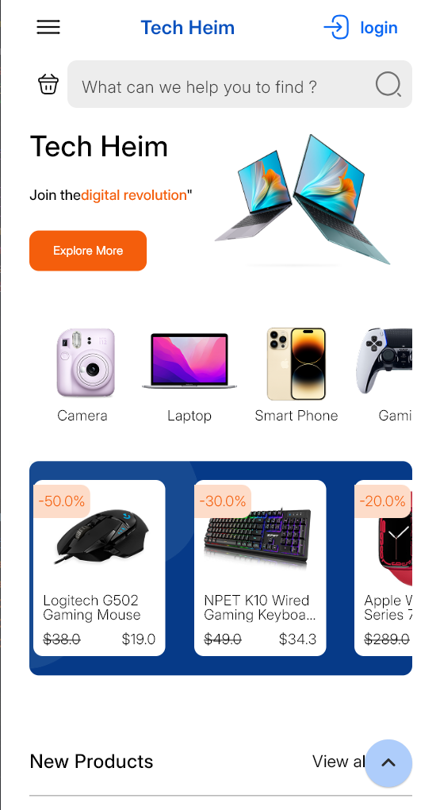
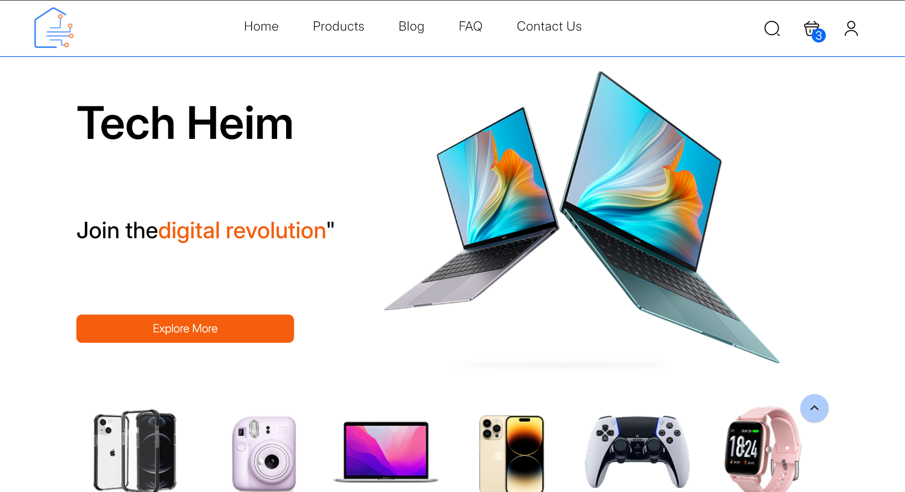

# Tech Space

Tech Space is a Flutter project focused on converting the **Tech Heim** Figma design into a fully responsive application for both **web and mobile**. The goal is to ensure a seamless and adaptive user experience across different screen sizes while maintaining high performance and best development practices.

## Features
- **Fully responsive design** for mobile and web  
- **Modern UI** based on the Tech Heim Figma design  
- **Scalable architecture** for maintainability  
- **Cross-platform compatibility** with Flutter  

## Tech Stack
- **Flutter** (Dart)  
- **Riverpod** (State Management) 

## Getting Started
1. Clone the repository:  
   ```sh
   git clone https://github.com/Ahmed2000Github/tech_space.git  
   ```
2. Navigate to the project folder:  
   ```sh
   cd tech_space  
   ```
3. Install dependencies:  
   ```sh
   flutter pub get  
   ```
4. Run the app:  
   ```sh
   flutter run  
   ```  

## Design Reference
Figma Design: [Tech Heim Figma](https://www.figma.com/community/file/1286698427874906194)

## Screenshots
### Mobile View


### Web View


## Contributing
Feel free to fork the repo, submit issues, or contribute by making pull requests.

## License
MIT License 
